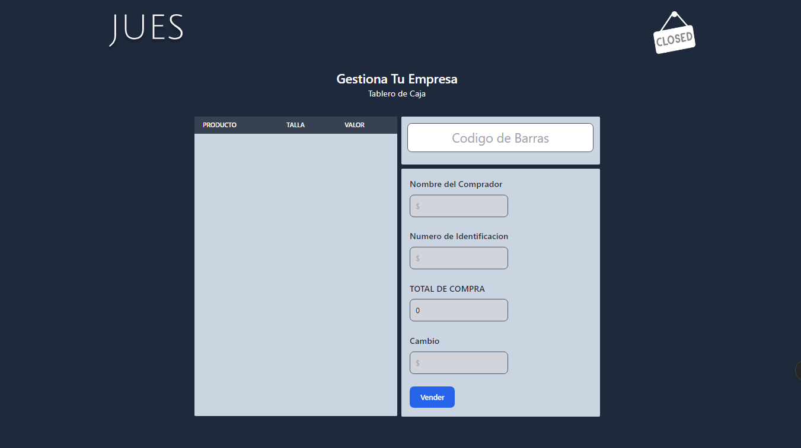

# JUES-howosell 
Para la participacion en un Concurso de Desarrollo en mi Universidad decidi crear una aplicacion que sirve para hacer un control de inventario, ingresar y facturar productos que generan un reporte en ecxel con power bi para el analisis de los datos,
Esta apliacion fue desarrollada en SpringBoot y react 

## Install 
El proyecto se encuetra en dos ramas de git para que descargues y pruebes
Asegúrate de tener instalado los complementos de React y SpringBoot y sus respectivos comando de despliegue para que funcione. 

## Aportes Personales 
Una mirada detallada a esta aplicacion fue su implementacion a Ecxel y Power Bi algo practico en el contexto utilizando herramientas conocidas para el Analisis Empresarial

